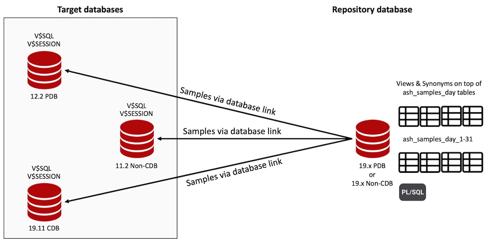

# YaASHs - Yet another ASH simulator
YaASHs is a free PL/SQL tool and open source project that simulates Oracle's ASH functionality, which is usually only available with the Oracle Enterprise Edition (plus diagnostic pack).

This project was inspired by [OraSASH](http://pioro.github.io/orasash/) but is a complete rewrite from the scratch with a different focus and following benefits:
* 100% compatibility with original ASH objects like (G)V$ACTIVE_SESSION_HISTORY
* Easier to maintain various Oracle target database versions
* No object installation needed in Oracle target database by default (standard mode)
* ASH sampling with additional columns if you are allowed / it is possible to create one view in Oracle target database (advanced mode)
* Tools like [ashtop.sql](https://github.com/tanelpoder/tpt-oracle/blob/master/ash/ashtop.sql) or [ash_wait_chains.sql](https://github.com/tanelpoder/tpt-oracle/blob/master/ash/ash_wait_chains.sql) by Tanel Poder should work out of the box because of 100% ASH compatibility
* No replacement for STATSPACK in the target database as YaASHs focuses on sampling V$SESSION (and V$SQLAREA) for ASH only and should be considered as an addition/extension to STATSPACK (same like AWR reports vs. ASH samples)




## Required and tested versions
All editions of an Oracle database (even Oracle XE) can be used for the repository and/or target database and all kind of instance types like single or RAC and multitenant architectures like Non-CDBs, CDBs or PDBs are supported as well.
* **Repository database:** Minimum required version 18.x (due to used PL/SQL functionality) - Tested versions are 19.x
* **Target database:** Minimum required version 10.x - Tested versions are 10.2.0.5, 11.2.x, 12.1.x, 12.2.x, 18.x, 19.x


## Installation
The installation itself is a guided procedure. Just execute the "setup.sh" script and run it once for the repository database and once for each target database that should be monitored. The only prerequisite is a SQLPlus client (on a system with bash shell), that is able to connect to the corresponding databases with a database user (with SYSDBA privileges). All SQLPlus connections and database links use Oracle's Easy Connect syntax. 
```
shell> ./setup.sh 
What kind of user do you want to deploy?
* Enter 1 for user in target database (= database that should be monitored) - no objects will be installed in the database
* Enter 2 for user in repository database (= database that polls and stores the samples) - objects and PL/SQL code will be installed in the database
```


## Documentation
### Objects in the repository database
* **ASH_SAMPLES_DAY_[1-31]** - Tables that store the ASH samples per day
* **COL_MAPPING** - Table that defines the column mapping between V$SESSION and (G)V$ACTIVE_SESSION_HISTORY for each main Oracle version
* **CONFIGURATION** - Table that includes the repository configuration
* **MESSAGES** - Table that stores all error messages
* **SQL** - Table that stores all SQL (text) samples that are included in ASH samples
* **TARGETS** - Table that stores metadata for all configured target databases
* **ACTIVE_SESSION_HISTORY_ALL** - View over all ASH_SAMPLES_DAY_[1-31] tables
* **ACTIVE_SESSION_HISTORY_DAILY** - View for the current (same day) ASH_SAMPLES_DAY_[1-31] table
* **DBA_HIST_ACTIVE_SESS_HISTORY** - Synonym to ACTIVE_SESSION_HISTORY_ALL, which means that all ASH sample queries that are executed in schema YAASHSR in the repository database are redirected to YaASHs
* **GV$ACTIVE_SESSION_HISTORY** - Synonym to ACTIVE_SESSION_HISTORY_ALL, which means that all ASH sample queries that are executed in schema YAASHSR in the repository database are redirected to YaASHs
* **V$ACTIVE_SESSION_HISTORY** - Synonym to ACTIVE_SESSION_HISTORY_ALL, which means that all ASH sample queries that are executed in schema YAASHSR in the repository database are redirected to YaASHs
* **YAASHS_DIR** - Directory for exporting and importing target databases (including all corresponding ASH and SQL ID/text samples) with Data Pump

### Changing (global) configuration in the repository database
Available configuration options are:
* **RETENTION_DAYS** - Specifies the retention period (in days) of ASH (and corresponding SQL) samples in the repository database. Default: 14 , Min value: 1 , Max value: 31
* **SAMPLEFREQ_SEC** - Specifies the ASH sampling frequency (in seconds), which means how often a snapshot of V$SESSION is collected on the target. Default: 1 , Possible values: SAMPLEFREQ_SEC x SAMPLEDURA_SEC must be smaller than 3600 and a full minute value
* **SAMPLEDURA_SEC** - Specifies the ASH sampling duration (in seconds) in combination with SAMPLEFREQ_SEC, which means how long an ASH collection job will run and how large the gap between two SQL ID/text snaps will be. Default: 900 , Possible values: SAMPLEFREQ_SEC x SAMPLEDURA_SEC must be smaller than 3600 and a full minute value 
* **SAMPLE_IDLE** - Specifies if idling sessions (of each target database) should be included in the ASH samples (kind of equivalent to "_ash_sample_all"). Default: NO , Possible values: YES/NO
```
SQL> exec yaashsr.repo.alter_config('RETENTION_DAYS','7');
SQL> exec yaashsr.repo.alter_config('SAMPLEDURA_SEC','300');
SQL> exec yaashsr.repo.alter_config('SAMPLEFREQ_SEC','2');
SQL> exec yaashsr.repo.alter_config('SAMPLE_IDLE','YES');
```

### Adding a single instance / database
```
SQL> exec yaashsr.repo.add_target(  p_name => '<DATABASE_NAME>', 
                                    p_host_name => '<HOST_NAME>', 
                                    p_listener_port => <LISTENER_PORT>, 
                                    p_service_name => '<SERVICE_NAME>',
                                    p_username => '<USERNAME_IN_TARGET_DATABASE>',
                                    p_password => '<PASSWORD_OF_USER_IN_TARGET_DATABASE>');
```
### Adding a RAC instance / database (needs to be done for every RAC instance / database that should be sampled/monitored)
```
SQL> exec yaashsr.repo.add_target(  p_name => '<DATABASE_NAME>', 
                                    p_host_name => '<HOST_NAME>', 
                                    p_listener_port => <LISTENER_PORT>, 
                                    p_service_name => '<SERVICE_NAME>', 
                                    p_instance_number => <INSTANCE_NUMBER_OF_RAC_INSTANCE>,
                                    p_instance_name => '<INSTANCE_NAME_OF_RAC_INSTANCE>',
                                    p_username => '<USERNAME_IN_TARGET_DATABASE>',
                                    p_password => '<PASSWORD_OF_USER_IN_TARGET_DATABASE>');
```
### Deleting a target database and disable its ASH (and SQL ID/text) sampling
```
-- Parameter values can be obtained from table yaashsr.targets if unknown
SQL> exec yaashsr.repo.delete_target(  p_name => '<DATABASE_NAME>', 
                                       p_instance_number => <INSTANCE_NUMBER>, 
                                       p_dbid => <DBID>);
```

### Disabling a target database and its ASH (and SQL ID/text) sampling
```
-- Parameter values can be obtained from table yaashsr.targets if unknown
SQL> exec yaashsr.repo.change_target_status(  p_name => '<DATABASE_NAME>', 
                                              p_instance_number => <INSTANCE_NUMBER>, 
                                              p_dbid => <DBID>, 
                                              p_status => 'DISABLED');
```

### Enabling a target database and its ASH (and SQL ID/text) sampling
```
-- Parameter values can be obtained from table yaashsr.targets if unknown
SQL> exec yaashsr.repo.change_target_status(  p_name => '<DATABASE_NAME>', 
                                              p_instance_number => <INSTANCE_NUMBER>, 
                                              p_dbid => <DBID>, 
                                              p_status => 'ENABLED');
```

### Advanced ASH sampling mode (Target database version 11.2.x or higher is needed)
After a target database has been added to the repository (and is enabled) the sampling type/mode can be changed as documented in this section. One view needs to be installed in the target database for advanced ASH sampling mode as YaASHs needs access to x$ksuse for that. In advanced ASH sampling mode the following additional ASH columns are populated:
* **SQL_PLAN_HASH_VALUE** - Numeric representation of the SQL plan for the cursor
* **TIME_MODEL** - Time model information
* **IN_CONNECTION_MGMT** - Indicates whether the session was doing connection management at the time of sampling
* **IN_PARSE** - Indicates whether the session was parsing at the time of sampling
* **IN_HARD_PARSE** - Indicates whether the session was hard parsing at the time of sampling
* **IN_SQL_EXECUTION** - Indicates whether the session was executing SQL statements at the time of sampling
* **IN_PLSQL_EXECUTION** - Indicates whether the session was executing PL/SQL at the time of sampling
* **IN_PLSQL_RPC** - Indicates whether the session was executing inbound PL/SQL RPC calls at the time of sampling
* **IN_PLSQL_COMPILATION** - Indicates whether the session was compiling PL/SQL at the time of sampling 
* **IN_JAVA_EXECUTION** - Indicates whether the session was executing Java at the time of sampling 
* **IN_BIND** - Indicates whether the session was doing bind operations at the time of sampling 
* **IN_CURSOR_CLOSE** - Indicates whether the session was closing a cursor at the time of sampling 
* **IN_SEQUENCE_LOAD** - Indicates whether the session is loading in sequence (in sequence load code)
* **IN_INMEMORY_QUERY** - Indicates whether the session was querying the In-Memory Column Store (IM column store) at the time of sampling
* **IN_INMEMORY_POPULATE** - Indicates whether the session was populating the IM column store at the time of sampling
* **IN_INMEMORY_PREPOPULATE** - Indicates whether the session was prepopulating the IM column store at the time of sampling 
* **IN_INMEMORY_REPOPULATE** - Indicates whether the session was repopulating the IM column store at the time of sampling
* **IN_INMEMORY_TREPOPULATE** - Indicates whether the session was trickle repopulating the IM column store at the time of sampling
* **IN_TABLESPACE_ENCRYPTION** - Indicates whether encryption or decryption of a tablespace occurred at the time of sampling

#### Enabling advanced ASH sampling mode
```
-- Parameter values can be obtained from table yaashsr.targets if unknown
-- Follow the instructions that are printed out by yaashsr.repo.generate_advanced_view_target
SQL> set serveroutput on;
SQL> exec yaashsr.repo.generate_advanced_view_target(  p_name => '<DATABASE_NAME>', 
                                                       p_dbid => <DBID>);

-- Execute the following procedure after the view (and its grant) has been created in target database
SQL> exec yaashsr.repo.change_target_type(  p_name => '<DATABASE_NAME>', 
                                            p_dbid => <DBID>,
                                            p_sampling_type => 'ADVANCED');
```

#### Disabling advanced ASH sampling mode / Reverting to standard ASH sampling mode
```
-- Parameter values can be obtained from table yaashsr.targets if unknown
SQL> exec yaashsr.repo.change_target_type(  p_name => '<DATABASE_NAME>', 
                                            p_dbid => <DBID>,
                                            p_sampling_type => 'STANDARD');
```


### Transporting target database(s) between repository databases
Transporting all target databases or just a single target database (including all corresponding ASH and SQL ID/text samples) can be useful in case of remote performance troubleshooting/consulting (e.g. external consultant has no direct access to repository database) or for upgrading YaASHs to a new version. In case of a YaASHs upgrade - export all target databases, re-create the repository database (with the new YaASHs code base and with help of script [setup.sh](#installation)) and finally import all target databases again.
#### Exporting
```
-- Parameter values can be obtained from table yaashsr.targets if unknown
-- Exporting a single target database to directory YAASHS_DIR with Data Pump
SQL> exec yaashsr.repo.transport_target_export(  p_name => '<DATABASE_NAME>', 
                                                 p_dbid => <DBID>);

-- Exporting all target databases to directory YAASHS_DIR with Data Pump
SQL> exec yaashsr.repo.transport_target_export(  p_name => NULL, 
                                                 p_dbid => NULL);
```

#### Importing
All target databases will be imported with status IMPORTED which means that ASH (and SQL ID/text) sampling is not performed for the imported target databases by default. Please use the described procedure [here](#enabling-a-target-database-and-its-ash-and-sql-idtext-sampling) to enable ASH (and SQL ID/text) sampling for the imported target database(s) again.
```
-- Copy Data Pump dump file to YAASHS_DIR
-- Parameter values can be obtained from Data Pump dump file name (e.g. YAASHS_EXPORT_ALL_TARGETS.dmp = NULL & NULL or YAASHS_EXPORT_<DATABASE_NAME>_<DBID>.dmp)
-- Importing a single target database into the repository database with Data Pump
SQL> exec yaashsr.repo.transport_target_import(  p_name => '<DATABASE_NAME>', 
                                                 p_dbid => <DBID>);

-- Importing all target databases into the repository database with Data Pump
SQL> exec yaashsr.repo.transport_target_import(  p_name => NULL, 
                                                 p_dbid => NULL);
```


### Exemplary output of Tanel Poder's [ashtop.sql](https://github.com/tanelpoder/tpt-oracle/blob/master/ash/ashtop.sql) with YaASHs
```
-- Connect to repository database as user yaashsr
shell> sqlplus yaashsr/yaashsr@<HOST_NAME>:<LISTENER_PORT>/<SERVICE_NAME>

-- You can use the additional columns name or dbid in (g)v$active_session_history to filter on a particular target database as the repository database includes samples for all target databases
SQL> @ashtop.sql sql_id,event2 name='T1911DB' SYSDATE-1/24 SYSDATE
    Total														                                                             Distinct Distinct
  Seconds     AAS %This   SQL_ID	    EVENT2					                   FIRST_SEEN	       LAST_SEEN	       Execs Seen  Tstamps
--------- ------- ------- ------------- ------------------------------------------ ------------------- ------------------- ---------- --------
      870      .2   25% |		        rdbms ipc message			               2023-01-05 10:01:29 2023-01-05 10:04:41	    1	    58
      464      .1   13% |		        Space Manager: slave idle wait		       2023-01-05 10:01:29 2023-01-05 10:04:41	    1	    58
      459      .1   13% |		        class slave wait			               2023-01-05 10:01:29 2023-01-05 10:04:41	    1	    58
      174      .0    5% |		        pmon timer				                   2023-01-05 10:01:29 2023-01-05 10:04:41	    1	    58
      116      .0    3% |		        DIAG idle wait				               2023-01-05 10:01:29 2023-01-05 10:04:41	    1	    58
      116      .0    3% |		        LGWR worker group idle			           2023-01-05 10:01:29 2023-01-05 10:04:41	    1	    58
      116      .0    3% |		        Streams AQ: qmn slave idle wait 	       2023-01-05 10:01:29 2023-01-05 10:04:41	    1	    58
      116      .0    3% |		        watchdog main loop			               2023-01-05 10:01:29 2023-01-05 10:04:41	    1	    58
       83      .0    2% |		        SQL*Net message from client		           2023-01-05 10:01:29 2023-01-05 10:04:41	    1	    58
       58      .0    2% | 47ak68rdxmpcm SQL*Net message to client		           2023-01-05 10:01:29 2023-01-05 10:04:41	   58	    58
       58      .0    2% | dup1zf9m958dc SQL*Net message from dblink		           2023-01-05 10:01:29 2023-01-05 10:04:41	   58	    58
       58      .0    2% |		        AQPC idle				                   2023-01-05 10:01:29 2023-01-05 10:04:41	    1	    58
       58      .0    2% |		        Data Guard: Gap Manager 		           2023-01-05 10:01:29 2023-01-05 10:04:41	    1	    58
       58      .0    2% |		        Data Guard: Timer			               2023-01-05 10:01:29 2023-01-05 10:04:41	    1	    58
       58      .0    2% |		        OFS idle				                   2023-01-05 10:01:29 2023-01-05 10:04:41	    1	    58
```

### Exemplary output of Tanel Poder's [ash_wait_chains.sql](https://github.com/tanelpoder/tpt-oracle/blob/master/ash/ash_wait_chains.sql) with YaASHs
```
-- Connect to repository database as user yaashsr
shell> sqlplus yaashsr/yaashsr@<HOST_NAME>:<LISTENER_PORT>/<SERVICE_NAME>

-- You can use the additional columns name or dbid in (g)v$active_session_history to filter on a particular target database as the repository database includes samples for all target databases
SQL> @ash_wait_chains.sql  username||':'||program2||event2 "name='T1911DB' and event='enq: TX - row lock contention'" SYSDATE-1/24 SYSDATE
%This	  SECONDS AAS     #Blkrs WAIT_CHAIN                                                                          FIRST_SEEN	         LAST_SEEN
------ ---------- ------- ------ ----------------------------------------------------------------------------------- ------------------- -------------------
 100%	       70      .0      1 -> SYS:(sqlplus) enq: TX - row lock contention [mode=6]  -> [idle blocker 1,28,]    2023-01-06 11:50:12 2023-01-06 11:52:34
```


## Feedback
If you have any feedback, please reach out to me or feel free to participate in this project.


## Author / Maintainer
- [Stefan Koehler](http://www.soocs.de)
